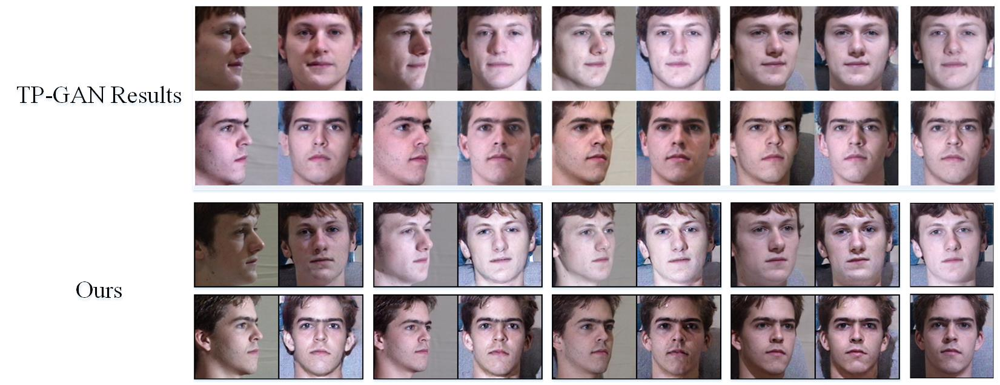

## Face Frontalization
This is official Pytorch implementation for the paper "Simple and Efficient Practices for Profile-to-frontal Face Synthesis and Recognition" by Huijiao Wang, Haijian Zhang and Xulei Yang.

The target is to provide three simple but efficient practices to CR-GAN when synthesising a frontal face image from a profile.

The following is the visual comparison results with [TP-GAN](https://github.com/HRLTY/TP-GAN).

## Acknowledgement
A large part of the code is borrowed from [CR-GAN](https://github.com/bluer555/CR-GAN). 
